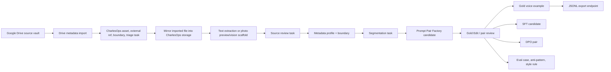

# CharlesOps Current Functionality Reviewer Packet

Date: 2026-04-27

This document is a snapshot of the CharlesOps product as it exists now. It is intended for a reviewer agent that has not been involved in the build so far and should be able to give a second opinion on architecture, product flow, UX, and gaps.

## 1. Product Purpose

CharlesOps is a single-user, human-in-the-loop production asset library and annotation engine for a large personal archive. The archive includes Google Drive folders with photos, writing files, emails, and eventually audio/video/journals. The product is not a chatbot. Its job is to ingest source material, preserve provenance, copy source files into CharlesOps-controlled storage, extract reviewable text or image metadata, route human review tasks, and produce downstream-safe records for retrieval, voice modeling, SFT, DPO, eval, gallery, and future embedding workflows.

The working design principle is strict separation between:

- source truth: archival files, transcripts, quotes, email bodies, photos
- Adam memory: Adam's firsthand context, interpretation, family knowledge, and corrections
- system inference: machine-generated metadata, OCR, vision guesses, suggestions
- model-generated reconstruction: draft prompt responses or synthetic text
- Adam expert reconstruction: Adam-approved/gold-edited outputs

## 2. Current Stack

- `apps/web`: Next.js, React, TypeScript workbench UI
- `apps/api`: FastAPI, SQLModel/SQLAlchemy, Alembic migrations
- `db`: Postgres via Docker Compose
- `storage/`: local object storage folders, with Google Cloud Storage also supported as the intended mirror store
- Google Drive integration: browser-based Google Picker and Drive API flow
- Google Cloud Storage mirror flow: browser obtains a temporary GCS OAuth token and passes it to the local API for upload only

Local URLs:

- Web: `http://localhost:3003/` in current development
- API health: `http://localhost:8000/api/health`
- API docs: `http://localhost:8000/docs`

## 3. High-Level Workflow

The full mirrored source remains retained. Segmentation does not replace the source; it selects usable chunks and records how those chunks may be used.

## 4. Core Data Model Implemented

The database includes explicit tables for:

- assets and provenance: `assets`, `external_refs`, `asset_snapshots`, `object_files`, `derivatives`
- source decomposition: `segments`
- people/context graph: `entities`, `entity_aliases`, `memories`, `memory_sources`, `graph_edges`
- privacy/use gates: `boundaries`
- work queue: `tasks`, `task_drafts`, `annotations`
- reviewed metadata: `metadata_profiles`
- voice/prompt outputs: `prompt_specs`, `context_packs`, `context_pack_items`, `generations`, `generation_reviews`, `gold_voice_examples`
- downstream training/eval records: `sft_candidates`, `dpo_pairs`, `eval_cases`, `anti_patterns`, `style_rules`
- exports/galleries: `dataset_exports`, `dataset_export_items`, `galleries`, `gallery_items`

Important table roles:

- `Asset`: the source-level object, such as a Drive photo, doc, email file, audio file, or folder.
- `ExternalRef`: a pointer back to the source system, especially Google Drive. This preserves provenance and does not imply CharlesOps owns the bytes yet.
- `ObjectFile`: a record for a stored object. In metadata-only Drive imports this may be a Drive pseudo-object; after mirroring it points to local or GCS object storage.
- `AssetSnapshot`: a versioned snapshot of either Drive metadata or a source mirror.
- `Segment`: extracted text previews, text chunks, and future OCR/vision-derived text.
- `MetadataProfile`: Adam-reviewed or machine-draft metadata around a source, segment, photo, scan, or vision draft.
- `Boundary`: privacy/export/retrieval gates. These are required before downstream export.
- `Task`: a queued human review/processing unit.
- `Annotation`: the durable record created on task submission. The annotation stores Adam's decisions and lists records created or updated.

## 5. Google Drive Intake

The web UI includes a Google Drive import panel. It can:

- open Google Picker for manually selected files
- open Google Picker for a folder
- accept a pasted Drive folder link or folder ID
- scan folder contents recursively
- cap scan size and candidate count
- filter by text, photos, email, audio, video, PDFs, Google Docs, and other candidate kinds
- skip backup-looking folders by default
- import candidates in batches of 50
- mirror imported files after metadata import

Current default scanning behavior:

- default scan cap: 100 files
- maximum scan cap: 10,000 files
- default candidate cap: 100
- maximum candidate cap: 1,000
- default mirror size cap: 50 MB
- maximum mirror size cap: 500 MB

The scan cap refers to file items scanned, not pages. Folders are tracked separately.

### Metadata Import

Drive metadata import creates or updates:

- `Asset`
- `ExternalRef`
- `ObjectFile` with Drive metadata pseudo-object
- `AssetSnapshot` of type `drive_metadata`
- default unreviewed `Boundary`
- optional `asset_triage` task
- `Annotation` of type `drive_metadata_import`

The original Drive file is not mutated.

### Mirroring

The Mirror imported action downloads selected Drive files and uploads/copies them into CharlesOps-controlled storage.

Blob files are downloaded via Drive `files.get?alt=media`. Native Google Workspace files are exported to Office/PDF-like snapshots using Drive export formats. The backend creates:

- `ObjectFile` with local or GCS storage URI
- `AssetSnapshot` of type `source_mirror`
- `Annotation` of type `asset_mirrored`
- updated `ExternalRef` metadata with mirror status and latest mirror object

The preferred mirror provider for this project is Google Cloud Storage. Local storage remains available as a fallback.

## 6. Text Extraction and Chunking

After mirroring, the backend attempts text extraction for supported formats:

- `.txt`, `.md`
- `.html`, `.htm`
- `.rtf`
- `.docx`
- `.eml`
- Google Docs exported to a supported document format

Current limitations:

- legacy `.doc` is detected but marked unsupported until a conversion step is added
- PDFs are currently treated as text-like assets in intake but do not yet have full OCR/PDF text extraction
- email parsing exists, but email line wrapping and quote/thread handling will need continued refinement

Extraction behavior:

- preview cap: 4,000 chars
- total extracted text cap: 2,000,000 chars
- chunk target: 6,000 chars
- max chunks: 400
- chunking prefers paragraph or sentence breakpoints when available

Text extraction creates:

- `Derivative` of type `text_extraction`
- a `Segment` of type `text_preview`
- `Segment` records of type `text_chunk`
- a review task:
  - `text_segment_review` for documents
  - `email_voice_sample` for emails

The source preview now soft-wraps long text lines in the UI for readability.

## 7. Current Workbench UI

The top-left product title is now `Workbench`.

The UI has an IDE-like layout:

- compact dark theme
- top bar with branch/status pills and global nav
- left rail with workstream navigation
- queue column with task cards
- center review canvas
- right inspector panel
- bottom action bar

Implemented UI affordances:

- resizable left sidebar, queue column, and inspector panel
- queue cards with human-readable titles/subtitles
- queue collection filters and mode filters
- hover tooltips for built and planned controls
- autosaved task drafts with debounce
- submit/skip/flag actions
- status selector for review state display
- photo preview panel for photo/vision tasks when an image preview is available
- source text preview with soft wrapping
- chunk browser for segmentation tasks
- side-by-side response comparison for pair/gold edit review
- Response A and Response B rubric columns

Current nav/workstreams:

- Intake
- All Queue
- Source Review
- Segmentation
- Pair Factory
- Gold Edits
- Privacy
- Exports
- Models
- Settings

Some nav items are currently filters or placeholders rather than full separate pages. Tooltips now state whether a control is built, partially built, or planned.

## 8. Task Types and Submit Behavior

Every task submission creates an `Annotation`, marks the task `submitted`, clears the user's draft, and may create or update downstream records depending on task type.

### `asset_triage`

Created by Drive metadata import. Currently supports initial review flow but has less downstream automation than the newer source-review and segmentation flows.

### `text_segment_review`

Used for mirrored documents.

The center UI asks plain-language questions:

- What should we call this segment?
- What kind of document is it?
- Who made it?
- How should authorship be categorized?
- What should we remember about authorship?
- Is it factual, fictional, or mixed?
- Where does its truth come from?
- Is Charles's voice actually present?
- Who/where/when is it about?
- Why does Adam think it matters?
- Should this move to segmentation?
- How private is this source?

The person selector can load existing people and create a new `Entity` person record with relationship-to-Charles and relationship-to-Adam context.

On submit, backend creates/updates:

- `Annotation`
- reviewed `Segment` metadata
- segment-level `Boundary`
- `MetadataProfile`
- `text_segment_boundary_review` task if ready for processing

### `email_voice_sample`

Used for `.eml` sources. It recognizes that emails may contain multiple voices and that Charles may be absent, quoted, partial, or primary.

Current UI records:

- whether Charles's voice is present
- Charles's role in the email
- other voice roles
- context use
- quote/forwarded material presence
- whether it can be used for voice context, grounded generation, SFT, or DPO
- privacy notes

On submit, it follows the source-review artifact path: annotation, metadata profile, boundary, and possible segmentation task.

### `text_segment_boundary_review`

This is the segmentation workflow. It is separate from source review.

The workflow reviews one chunk/chunk set at a time and records:

- boundary status: `approved_chunks`, `needs_split`, `needs_merge`, `exclude_for_now`
- multi-select source use modes:
  - `verbatim_preferred`: can quote/cite source
  - `grounded_synthesis_allowed`: can ground synthesis
  - `context_only`: can use as context but not direct training/export
  - `exclude`: do not use downstream
- prompt pair decision: yes/later/no
- privacy clearance:
  - `ok_for_local_generation`
  - `needs_redaction`
  - `background_or_off_record`
  - `review_before_export`
  - `do_not_export`
- redaction instructions
- segmentation notes
- privacy notes

On submit, backend creates/updates:

- `Annotation`
- boundary-reviewed segment/chunk metadata
- segment-level `Boundary`
- reviewed `MetadataProfile`
- `grounded_prompt_pair_candidate` task only if:
  - chunks are approved
  - selected chunks exist
  - prompt pair potential is medium/high
  - either verbatim quote or grounded synthesis is allowed
  - privacy clearance is not `do_not_export`

If the reviewer chooses `needs_split` or `needs_merge`, no prompt pair candidate is created. The notes are currently stored, but there is not yet an automatic rechunking job.

### `grounded_prompt_pair_candidate`

This is Pair Factory. It does not call a live model.

The UI asks what kind of prompt/response pair this source should become:

- grounded voice response
- email reply candidate
- memory scene candidate
- factual archive answer
- style eval case
- anti-pattern probe

It also records voice mode, truth mode, response shape, optional prompt text, optional rejected/pre-edit draft text, boundary clearance needed, and factory notes.

On submit, backend creates:

- `PromptSpec`
- `ContextPack`
- `Generation` with model name `prompt_pair_factory_stub_no_model_call`
- `gold_voice_edit` review task

If no prompt text is provided, the backend creates a conservative grounded prompt. If no draft is provided, it creates a deterministic stub draft that explicitly says no live model call occurred.

### `gold_voice_edit`

This is the acceptance/review step for model-like outputs and prompt pair drafts.

The UI has:

- grounding source excerpt, when available
- prompt field
- voice mode
- reconstruction/truth mode
- Response A: model draft or rejected candidate
- Response B: Adam's preferred/gold edit
- rationale: why the preferred version is more authentic
- issue rubric for both Response A and Response B
- export artifact toggles

Rubric axes:

- Voice authenticity
- Grounding / truth
- Restraint
- Concrete detail
- Prompt fit
- Privacy / export safety

Each rubric card supports:

- No issues
- Minor issues
- Major issues
- Not applicable
- free-text issue note when relevant

Response A notes become DPO rejection reasons and anti-pattern explanation. Response B rubric drives export readiness. Major Response B privacy/export safety issues block downstream exports.

On submit, backend creates/updates:

- `GoldVoiceExample`
- `GenerationReview`
- `SFTCandidate`
- `DPOPair`
- `EvalCase`
- `AntiPattern`
- `StyleRule`

Export status is `approved` only if required rating dimensions pass; otherwise `candidate`.

### `vision_draft_review`

This is groundwork for future vision model workflows. It does not call a live model.

The backend can create no-call vision draft metadata profiles for photo/scan assets. These profiles are `system_inference` and explicitly not truth until Adam reviews them.

The planned schema for future vision model output includes:

- visual summary
- visible people
- places
- time period guess
- objects
- themes
- OCR text
- handwriting text
- uncertainties
- suggested questions
- privacy flags
- confidence

The UI lets Adam review:

- draft accuracy
- accepted visual description
- people/places/date/tags/objects
- rejected system inferences
- dynamic questions for Adam
- why it matters
- OCR/handwriting status and corrected text
- privacy level
- whether it can move downstream

On submit, backend creates/updates:

- reviewed `MetadataProfile`
- if corrected OCR/handwriting is provided, a `Segment` of type `vision_ocr_text`

Live vision calls are intentionally blocked until an explicit provider gate and approval are added.

## 9. Photo Preview Status

Photo preview is partly implemented.

The web UI renders an image using `/api/assets/{asset_id}/preview`. The API can:

- serve a local mirrored image file if the mirror provider is `local`
- redirect to a Google Drive thumbnail link if available

Known limitation:

- when the mirror provider is GCS, the backend does not yet create signed URLs or proxy GCS image bytes. If no Drive thumbnail is available, the preview reports that the mirrored image preview is unavailable.

This should be reviewed because photo/scan workflows will benefit from reliable preview regardless of storage backend.

## 10. Dataset Export

There is a basic JSONL export API:

- `GET /api/dataset-exports/jsonl?export_type=sft`
- `GET /api/dataset-exports/jsonl?export_type=dpo`
- `POST /api/dataset-exports/build`
- `GET /api/dataset-exports`

SFT export emits approved/candidate messages from `SFTCandidate` rows. DPO export emits prompt/chosen/rejected/reason from `DPOPair` rows.

Current limitations:

- export UI is mostly a placeholder
- export gating is still simple
- boundary snapshots are recorded on export build but need a stronger permission filter before real private data leaves the system
- no fine-tuning APIs are called

## 11. API Surface Implemented

Health:

- `GET /health`
- `GET /api/health`

Assets:

- `GET /api/assets`
- `POST /api/assets`
- `GET /api/assets/{asset_id}`
- `PATCH /api/assets/{asset_id}`
- `GET /api/assets/{asset_id}/preview`
- `POST /api/assets/{asset_id}/mirror/upload`

Tasks:

- `GET /api/tasks`
- `GET /api/tasks/next`
- `GET /api/tasks/{task_id}`
- `GET /api/tasks/{task_id}/draft`
- `PUT /api/tasks/{task_id}/draft`
- `DELETE /api/tasks/{task_id}/draft`
- `POST /api/tasks/{task_id}/submit`
- `POST /api/tasks/{task_id}/skip`
- `POST /api/tasks/{task_id}/flag`

Annotations:

- `GET /api/annotations`
- `POST /api/annotations`
- `GET /api/targets/{target_type}/{target_id}/annotations`

Boundaries:

- `GET /api/boundaries`
- `GET /api/boundaries/{target_type}/{target_id}`
- `POST /api/boundaries`
- `PATCH /api/boundaries/{boundary_id}`

Entities:

- `GET /api/entities`
- `POST /api/entities`
- `GET /api/entities/{entity_id}`
- `PATCH /api/entities/{entity_id}`

Metadata profiles:

- `GET /api/metadata-profiles`
- `POST /api/metadata-profiles`
- `GET /api/metadata-profiles/{profile_id}`
- `PATCH /api/metadata-profiles/{profile_id}`

Segments:

- `GET /api/segments`

Memories:

- `GET /api/memories`
- `POST /api/memories`
- `GET /api/memories/{memory_id}`
- `PATCH /api/memories/{memory_id}`

Voice/prompt records:

- `GET /api/prompt-specs`
- `POST /api/prompt-specs`
- `GET /api/context-packs/{context_pack_id}`
- `GET /api/generations/{generation_id}`
- `POST /api/generations`
- `POST /api/generations/{generation_id}/review`
- `GET /api/gold-voice-examples`
- `POST /api/gold-voice-examples`

Imports:

- `GET /api/imports/drive/recent`
- `POST /api/imports/drive`

Prompt Pair Factory:

- `POST /api/prompt-pairs/batches`

Vision:

- `GET /api/vision/schema`
- `POST /api/vision/drafts/batches`

Dataset exports:

- `GET /api/dataset-exports`
- `POST /api/dataset-exports/build`
- `GET /api/dataset-exports/jsonl`

## 12. What Is Real Versus Stubbed

Real and working:

- Docker Compose app stack
- Postgres schema and migrations
- seed data
- Google Drive OAuth/Picker intake
- folder scanning
- Drive metadata import
- source mirroring to local/GCS
- text extraction for supported formats
- text chunking
- source review metadata forms
- person/entity creation
- draft autosave
- segmentation review and gating
- no-call Pair Factory task creation
- gold edit review with Response A/B rubric
- downstream records for SFT/DPO/eval/anti-pattern/style-rule
- basic JSONL export endpoint
- no-call vision draft scaffolding
- tooltips for UI affordances and planned controls

Partially implemented:

- asset triage
- photo preview, especially with GCS
- Exports UI
- Models UI
- Settings UI
- Privacy workstream as a distinct review page
- automatic split/merge rechunking
- robust legacy `.doc` conversion
- PDF extraction/OCR
- email thread/quote parsing
- long-document whole-source context handling beyond retaining mirrored source and chunks
- advanced gallery flows

Intentionally not implemented yet:

- chatbot
- live model generation
- live vision model calls
- vector database / embeddings
- fine-tuning API calls
- public sharing
- unattended use of private material in exports

## 13. Current Test Coverage

Backend tests currently cover:

- Drive import creates asset/provenance/boundary/task/annotation
- Drive import idempotency
- recent Drive import metadata records
- asset mirror upload creates local object snapshot and annotation
- text mirror upload creates preview segments and review task
- email mirror upload creates multi-voice review task
- HTML email extraction spacing
- asset mirror idempotency
- GCS mirror recording path
- task submission creates gold voice/training artifacts
- task draft autosave and cleanup on submit
- source review creates processing task, then prompt candidate
- segmentation `needs_split` does not create prompt candidate
- metadata profile CRUD
- prompt pair candidate creates stub gold edit task
- entity CRUD
- vision draft batch creates system inference profile and review task
- live vision calls are blocked
- vision review submission promotes profile and creates OCR segment

Latest full backend test run before this document: 19 passing.

Frontend verification recently run:

- `npm run typecheck`
- `npm run build`

## 14. Reviewer Questions

Please review with these questions in mind:

1. Does the task lifecycle make sense as a durable annotation system, rather than just a form UI?
2. Are the workflow boundaries right: intake, source review, segmentation, prompt-pair creation, gold edit/export?
3. Are source truth, Adam memory, system inference, and generated reconstruction separated clearly enough in schema and UI?
4. Is the metadata schema too broad, too narrow, or missing key fields for retrieval/RAG/embeddings?
5. Is the segmentation gate the right place to decide quote policy, grounded synthesis, redaction, and prompt-pair eligibility?
6. Does the Response A/B rubric produce useful DPO reasons and SFT readiness signals?
7. Should source material labels use more rubric-like questions, fewer dropdowns, or a hybrid label:value inspector plus center-column questions?
8. What is the minimum safe next step for live vision model integration, given private photos and handwritten materials?
9. How should GCS photo previews be implemented safely: signed URLs, API proxy, temporary object tokens, or generated thumbnails?
10. What should be done with very large documents: full-context use, chunk-level review, summary/index layers, or all of these?
11. What permission checks must exist before JSONL exports can be considered safe for real downstream training?
12. Which current UI stubs are useful orientation affordances, and which should be removed until implemented?

## 15. Suggested Next Implementation Priorities

1. Make photo/scan preview reliable for GCS-backed mirrored assets.
2. Add a robust `.doc` conversion path and PDF text/OCR extraction path.
3. Implement automatic split/merge/rechunking from segmentation review notes.
4. Strengthen boundary-aware dataset export filtering before any real private export.
5. Add a live vision pipeline gate with explicit user approval, model/provider config, request logging, and per-asset review tasks.
6. Add embedding/vector planning tables or service boundaries without prematurely embedding private material.
7. Make Exports, Privacy, Models, and Settings either real pages or clearly marked inspector panels.
8. Add a reviewer-facing audit trail view: source file, mirror snapshot, extraction derivative, annotations, metadata profiles, boundaries, downstream records.

